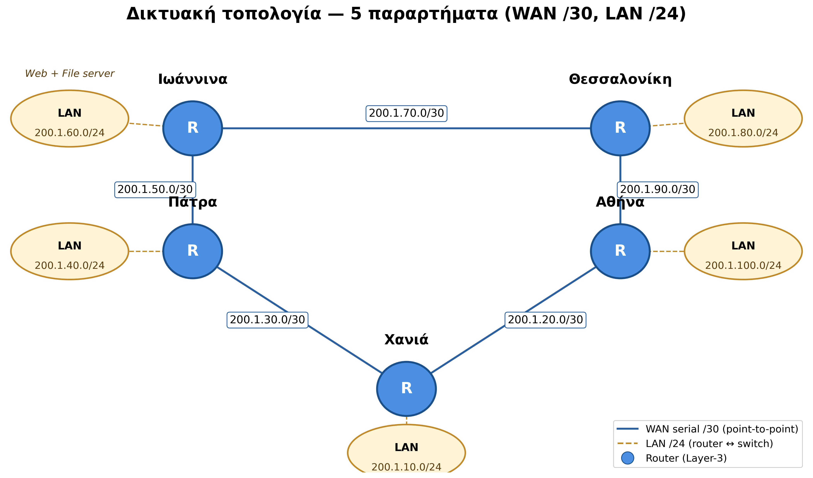
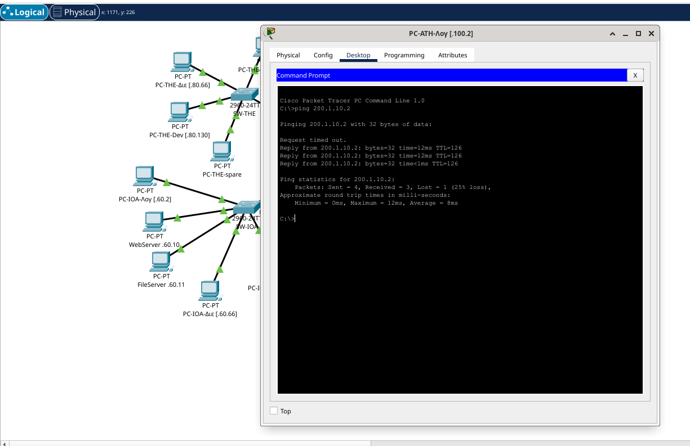
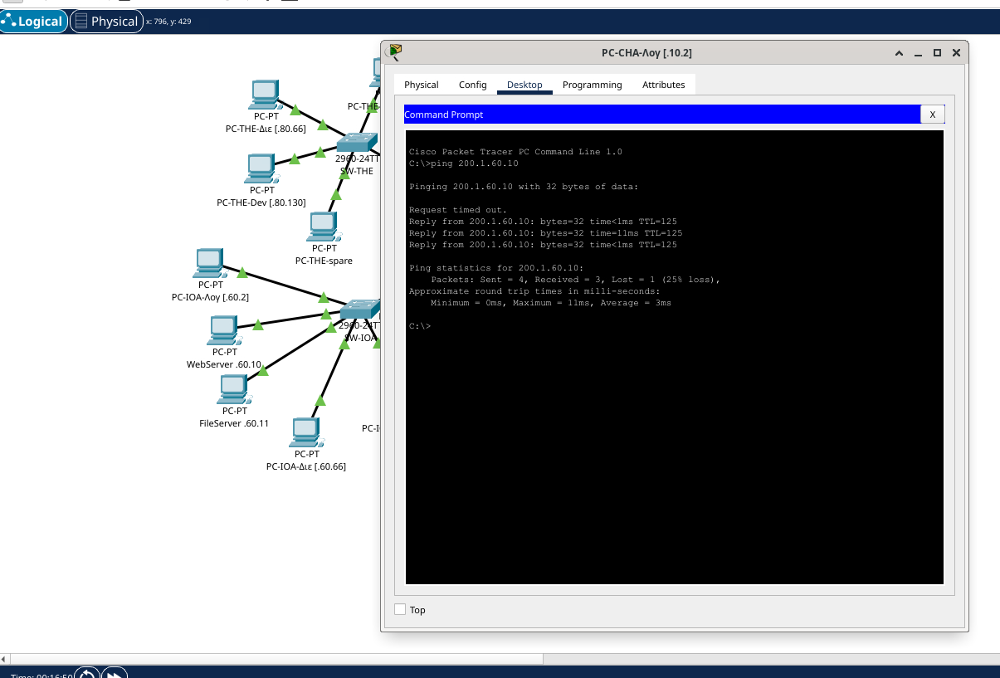
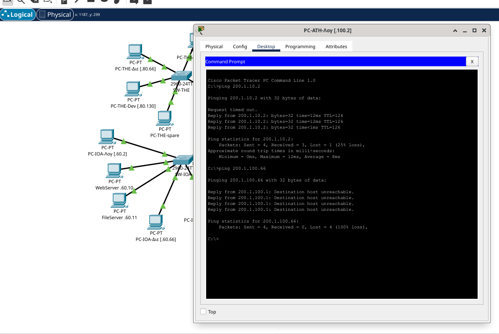
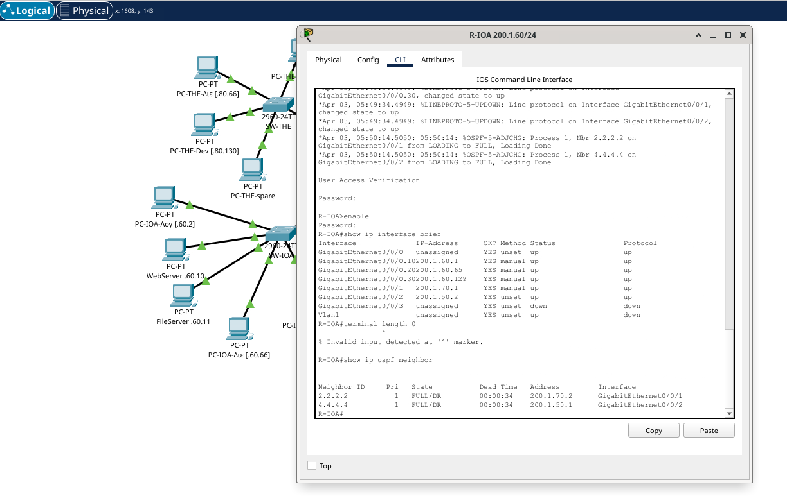
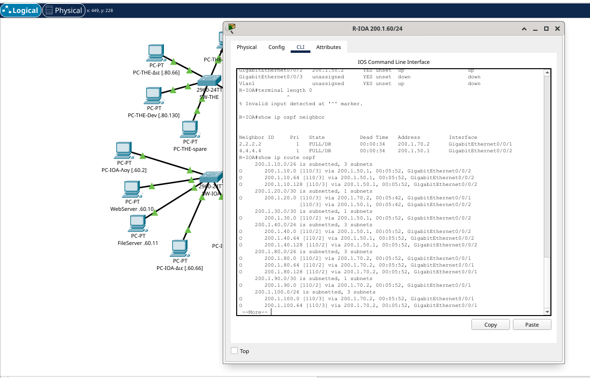
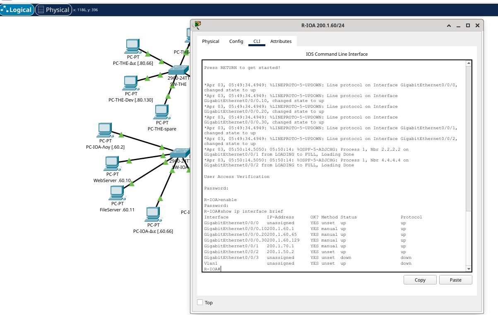
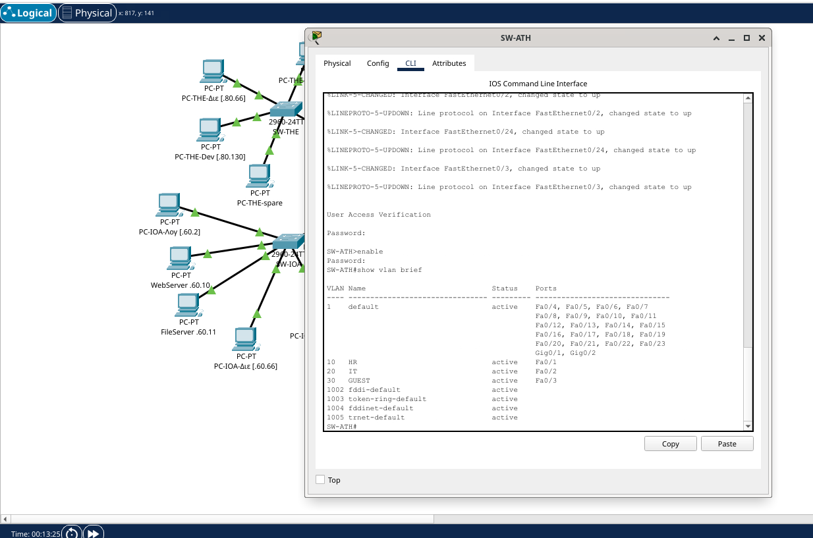
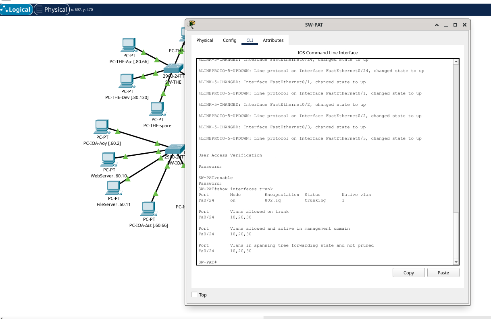
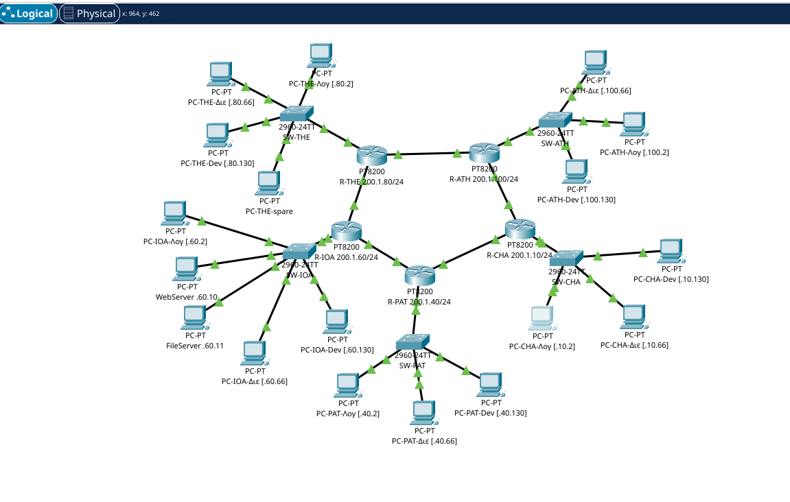

# Απαλλακτική Εργασία — Τεχνολογία Διαδικτύου στην Ψηφιακή Βιομηχανία

---

## 1. Εξώφυλλο

| Πεδίο | Στοιχείο |
|---|---|
| Σπουδάστρια | Ελένη Βασιλική Διαμάντη |
| Αριθμός Μητρώου | 19389308 |
| Μάθημα | Τεχνολογία Διαδικτύου στην Ψηφιακή Βιομηχανία |
| Διδάσκων | Δρ. Μιχάλης Ξευγένης |
| Τύπος εργασίας | Απαλλακτική |

---

## 2. Σύνοψη 

Η εργασία εχει δύο  παραδοτέα και τη συνοδευτική τεκμηρίωση:
(α) **Διαδικτυακή εφαρμογή PHP/MariaDB** πάνω σε XAMPP για τη **Διαχείριση Παραγγελιών** μιας μικρής επιχείρησης, με 4 πίνακες, 7 δυναμικές σελίδες και εντολές (PDO prepared statements)·
(β) **Δικτυακή τοπολογία 5 παραρτημάτων** (Ιωάννινα, Θεσσαλονίκη, Αθήνα, Πάτρα, Χανιά) σχεδιασμένη στο Cisco Packet Tracer, με υπο-διαίρεση κάθε LAN σε **3 VLAN** (Λογιστήριο, Διεύθυνση, Software Developers), δυναμική δρομολόγηση **OSPF area 0**, **inter-VLAN routing** με router-on-a-stick και **ACLs** για τον περιορισμό της επικοινωνίας μεταξύ τμημάτων.
Επιπλέον απαντώνται τα τρία θεωρητικά ερωτήματα (πλήθος υποδικτύων, αριθμός hosts, εύρος διευθύνσεων Θεσσαλονίκης).

Τα δύο παραδοτέα συνδέονται λειτουργικά: η εφαρμογή του Μέρους Α θα φιλοξενούνταν στον κεντρικό Web server του παραρτήματος Ιωαννίνων (200.1.60.10). Οι υπάλληλοι από τα άλλα τέσσερα παραρτήματα (Θεσσαλονίκη, Αθήνα, Πάτρα, Χανιά) θα είχαν πρόσβαση στην εφαρμογή μέσω του WAN δικτύου του Μέρους Β, με τη δυναμική δρομολόγηση OSPF να εξασφαλίζει τη μεταφορά των HTTP/SQL πακέτων end-to-end. Έτσι η ίδια βάση δεδομένων εξυπηρετεί όλη την επιχείρηση από ένα σημείο, με τις ACL του δικτύου να αποτελούν επιπλέον επίπεδο ασφάλειας πέρα από το επίπεδο εφαρμογής.

---

## 3. Μέρος Α — Διαδικτυακή Εφαρμογή (XAMPP)

### 3.1 Σενάριο

Μικρή επιχείρηση ηλεκτρονικών ειδών χρειάζεται απλό σύστημα **διαχείρισης παραγγελιών**: καταχώρηση πελατών, κατάλογος προϊόντων με απόθεμα, καταγραφή παραγγελιών με κατάσταση (νέα / πληρωμένη / αποσταλμένη / ακυρωμένη), και ανάλυση γραμμών παραγγελίας με «παγωμένη» τιμή τη στιγμή της πώλησης.

### 3.2 Αρχιτεκτονική client–server (3-tier)

<svg viewBox="0 0 820 210" xmlns="http://www.w3.org/2000/svg" style="max-width:100%;height:auto;background:#f5f7fa;border-radius:6px;padding:12px;font-family:'DejaVu Sans',sans-serif">
  <defs>
    <marker id="arrFM" viewBox="0 0 10 10" refX="9" refY="5" markerWidth="7" markerHeight="7" orient="auto"><path d="M0,0 L10,5 L0,10 z" fill="#444"/></marker>
  </defs>
  <rect x="215" y="35" width="400" height="115" rx="10" fill="none" stroke="#6a4a00" stroke-width="2" stroke-dasharray="6,4"/>
  <text x="415" y="28" text-anchor="middle" font-size="12" font-style="italic" fill="#6a4a00">Middle tier (mod_php SAPI)</text>
  <rect x="20"  y="50" width="170" height="90" rx="8" fill="#e8f0f8" stroke="#1a4f8a" stroke-width="2"/>
  <text x="105" y="85" text-anchor="middle" font-weight="bold" font-size="15">Browser</text>
  <text x="105" y="108" text-anchor="middle" font-size="12">(Chrome)</text>
  <rect x="225" y="50" width="180" height="90" rx="8" fill="#fff3d6" stroke="#a36a0d" stroke-width="2"/>
  <text x="315" y="85" text-anchor="middle" font-weight="bold" font-size="15">Apache</text>
  <text x="315" y="108" text-anchor="middle" font-size="12">(XAMPP)</text>
  <rect x="440" y="50" width="170" height="90" rx="8" fill="#cfe7d1" stroke="#2a7a32" stroke-width="2"/>
  <text x="525" y="85" text-anchor="middle" font-weight="bold" font-size="15">PHP</text>
  <text x="525" y="108" text-anchor="middle" font-size="12">PDO driver</text>
  <rect x="645" y="50" width="160" height="90" rx="8" fill="#ece2fb" stroke="#5a2db0" stroke-width="2"/>
  <text x="725" y="85" text-anchor="middle" font-weight="bold" font-size="15">MariaDB</text>
  <text x="725" y="108" text-anchor="middle" font-size="12">papinet</text>
  <path d="M190,82 L225,82"   stroke="#444" stroke-width="2" marker-end="url(#arrFM)"/>
  <text x="207" y="74"  text-anchor="middle" font-size="11" fill="#444">HTTP</text>
  <path d="M225,108 L190,108" stroke="#444" stroke-width="2" marker-end="url(#arrFM)"/>
  <path d="M405,82 L440,82"   stroke="#444" stroke-width="2" marker-end="url(#arrFM)"/>
  <text x="422" y="74"  text-anchor="middle" font-size="11" fill="#444">mod_php</text>
  <path d="M440,108 L405,108" stroke="#444" stroke-width="2" marker-end="url(#arrFM)"/>
  <path d="M610,82 L645,82"   stroke="#444" stroke-width="2" marker-end="url(#arrFM)"/>
  <text x="627" y="74"  text-anchor="middle" font-size="11" fill="#444">SQL</text>
  <path d="M645,108 L610,108" stroke="#444" stroke-width="2" marker-end="url(#arrFM)"/>
  <text x="627" y="124" text-anchor="middle" font-size="11" fill="#444">rows</text>
  <text x="105" y="190" text-anchor="middle" font-size="12" fill="#666">Παρουσίαση (HTML/CSS)</text>
  <text x="315" y="190" text-anchor="middle" font-size="12" fill="#666">Web server</text>
  <text x="525" y="190" text-anchor="middle" font-size="12" fill="#666">Επιχ. λογική (PDO)</text>
  <text x="725" y="190" text-anchor="middle" font-size="12" fill="#666">Αποθήκευση (4 πίνακες)</text>
</svg>

*Διαδραστική εκδοχή: [interactive/architecture.html](https://idpe19389308.github.io/papi-net/final-report/interactive/architecture.html)*

Η middle tier περιλαμβάνει τον Apache + PHP ως ένα ενιαίο επίπεδο (mod_php SAPI), σύμφωνα με την προεπιλεγμένη ρύθμιση του XAMPP. Ο φυλλομετρητής στέλνει αίτημα HTTP στον Apache· ο Apache καλεί τον PHP interpreter (φορτωμένο ως mod_php module μέσα στη διεργασία του Apache) που εκτελεί τη σελίδα και επικοινωνεί με τη βάση μέσω **PDO** (PHP Data Objects). Η απάντηση γυρίζει σε HTML/CSS πίσω στον browser.

### 3.3 Δομή ER και πίνακες

> 📊 **Διάγραμμα ER**: [διαδραστική εκδοχή με click-to-explore](https://idpe19389308.github.io/papi-net/final-report/interactive/er.html)

Τέσσερις πίνακες σε MariaDB / InnoDB, character set `utf8mb4` με συλλογή (collation) `utf8mb4_unicode_ci` για ελληνικά:

| Πίνακας | Σκοπός | Βασικά πεδία | Σχέσεις |
|---|---|---|---|
| `clients` | Αγοραστές | id, fullname, email, phone, city | 1—Ν προς `orders` |
| `products` | Κατάλογος | id, sku (UNIQUE), name, price, stock | 1—Ν προς `order_items` |
| `orders` | Κεφαλίδα παραγγελίας | id, client_id (FK), order_date, status (ENUM) | Ν—1 με `clients` (CASCADE), 1—Ν με `order_items` |
| `order_items` | Γραμμές παραγγελίας | id, order_id (FK), product_id (FK), qty, unit_price | Ν—1 με `orders` (CASCADE), Ν—1 με `products` (όχι CASCADE) |

**Σχεδιαστικές επιλογές**: το `unit_price` αποθηκεύεται ως **snapshot** της τιμής τη στιγμή της παραγγελίας — αν αύριο αλλάξει η τιμή του προϊόντος, οι παλιές παραγγελίες δεν αλλοιώνονται. Η διαγραφή πελάτη παρασύρει τις παραγγελίες του (CASCADE), αλλά η διαγραφή προϊόντος **εμποδίζεται** όσο υπάρχει σε ιστορικές παραγγελίες — διατήρηση ιστορικού.

### 3.4 Επτά δυναμικές σελίδες

| # | Αρχείο | Λειτουργία |
|---|---|---|
| 1 | [`index.php`](../webapp/public/index.php) | Πίνακας ελέγχου (dashboard): πλήθη πελατών / προϊόντων / παραγγελιών, τελευταίες κινήσεις |
| 2 | [`clients.php`](../webapp/public/clients.php) | Λίστα πελατών με αναζήτηση + κουμπί διαγραφής |
| 3 | [`clients_edit.php`](../webapp/public/clients_edit.php) | Φόρμα νέου / επεξεργασίας πελάτη (POST → PDO bind) |
| 4 | [`products.php`](../webapp/public/products.php) | Λίστα προϊόντων (sku, τιμή, απόθεμα) |
| 5 | [`products_edit.php`](../webapp/public/products_edit.php) | Φόρμα νέου / επεξεργασίας προϊόντος |
| 6 | [`orders.php`](../webapp/public/orders.php) | Λίστα παραγγελιών + φόρμα δημιουργίας νέας παραγγελίας με επιλογή πελάτη |
| 7 | [`orders_view.php`](../webapp/public/orders_view.php) | Λεπτομέρειες παραγγελίας: γραμμές προϊόντων, σύνολο, αλλαγή κατάστασης |

Κοινό header/footer/nav από `webapp/includes/`. Στυλ από [`assets/style.css`](../webapp/public/assets/style.css) (καμία εξωτερική εξάρτηση).

### 3.5 Βήματα ανάπτυξης + ασφάλεια

1. Εγκατάσταση **XAMPP**, εκκίνηση Apache + MySQL/MariaDB.
2. phpMyAdmin → Import [`webapp/sql/schema.sql`](../webapp/sql/schema.sql) (δημιουργεί τη βάση `papinet` και τους 4 πίνακες) και κατόπιν [`webapp/sql/seed.sql`](../webapp/sql/seed.sql) (5 πελάτες, 8 προϊόντα, 5 παραγγελίες, 12 γραμμές).
3. Αντιγραφή του φακέλου `webapp/public/` και `webapp/includes/` στο `htdocs/papinet/` του XAMPP.
4. Πλοήγηση σε `http://localhost/papinet/`.

**Ασφάλεια**:
- **PDO με prepared statements** σε όλα τα queries → αποτρέπει SQL injection.
- `htmlspecialchars()` σε κάθε output → αποτρέπει XSS.
- ENUM whitelist στο πεδίο `status` → εμποδίζει αυθαίρετες τιμές.
- UTF-8 headers ρητά (`Content-Type: text/html; charset=utf-8`).

### 3.6 GitHub repository

Ο κώδικας έχει δημοσιευτεί σε **δημόσιο** GitHub repository στη διεύθυνση: <https://github.com/idpe19389308/papi-net>.

- **README** στα Ελληνικά ([`webapp/README.md`](https://idpe19389308.github.io/papi-net/webapp/README.html)) στη ρίζα του repo, με: σενάριο, αρχιτεκτονική, οδηγίες εγκατάστασης, ER διάγραμμα, στοιχεία συγγραφέα.
- **LICENSE** παρόν στη ρίζα — άδεια **MIT** (επιτρέπει ελεύθερη χρήση/τροποποίηση με αναφορά).
- **Commit history** ορατό από οποιονδήποτε επισκέπτη (tab «Commits»), δείχνει την εξέλιξη της υλοποίησης βήμα-βήμα.
- **Branches**: η κύρια εργασία στο `main`· επιπλέον branches διαθέσιμα για δοκιμές/βελτιώσεις (tab «Branches»).
- **Δομή φακέλων**: `public/` (οι 7 .php σελίδες + assets), `includes/` (κοινό header/footer/db.php), `sql/` (schema.sql + seed.sql), `docs/` (τεκμηρίωση).

### 3.7 Δήλωση χρήσης εργαλείων Τεχνητής Νοημοσύνης

Όπως ζητάει η εκφώνηση, αναφέρω παρακάτω τη χρήση εργαλείων Τεχνητής Νοημοσύνης κατά την υλοποίηση της εργασίας.

Για το κείμενο της αναφοράς χρησιμοποίησα κυρίως το ChatGPT για ορθογραφικό έλεγχο, για αναδιατυπώσεις σε προτάσεις, και κάποιες φορές για να μου δώσει μια ιδέα για το πώς να δομήσω καλύτερα μια ενότητα.

Για τις δυναμικές σελίδες της εφαρμογής (Μέρος Α) χρησιμοποίησα τον Claude (Anthropic). Για παραδειγματα κώδικα PHP/PDO. Στη συνέχεια διάβαζα τον κώδικα γραμμή προς γραμμή, τον τροποποιούσα όπου ήθελα διαφορετική λογική ή UI, και τον δοκίμαζα τοπικά πάνω σε XAMPP. 

Για τις διαμορφώσεις του δικτύου (Μέρος Β) χρησιμοποίησα επίσης τον Claude. Για τις καταλληλες εντολες Cisco IOS (VLAN configuration, dot1Q subinterfaces, router ospf, access-lists, εφαρμογή ACL inbound στις subinterfaces). Δοκίμασα τα configs μέσα στο Packet Tracer, εντόπισα κάποια λάθη αντιστοίχισης IP που δεν ταίριαζαν με το PDF της εκφώνησης (συγκεκριμένα στο WAN link R-CHA ↔ R-PAT) και τα διόρθωσα.

Όλος ο κώδικας και όλα τα configs δοκιμάστηκαν από εμένα στο τοπικό μου περιβάλλον πριν την παράδοση.

---

## 4. Μέρος Β — Δικτυακή Τοπολογία (Cisco Packet Tracer)

### 4.1 Εικόνα τοπολογίας

Πέντε παραρτήματα συνδέονται με δακτύλιο WAN links.



*Διαδραστική εκδοχή: [interactive/topology.html](https://idpe19389308.github.io/papi-net/final-report/interactive/topology.html)*

### 4.2 Πίνακας 10 υποδικτύων (5 LAN /24 + 5 WAN /30)

| # | Υποδίκτυο | Μάσκα | Ρόλος | Πλήθος hosts |
|---|---|---|---|---|
| 1 | 200.1.10.0 | /24 | LAN Χανίων | 254 |
| 2 | 200.1.20.0 | /30 | WAN ATH↔CHA | 2 |
| 3 | 200.1.30.0 | /30 | WAN PAT↔CHA | 2 |
| 4 | 200.1.40.0 | /24 | LAN Πατρών | 254 |
| 5 | 200.1.50.0 | /30 | WAN IOA↔PAT | 2 |
| 6 | 200.1.60.0 | /24 | LAN Ιωαννίνων (Web + File server) | 254 |
| 7 | 200.1.70.0 | /30 | WAN IOA↔THE | 2 |
| 8 | 200.1.80.0 | /24 | LAN Θεσσαλονίκης | 254 |
| 9 | 200.1.90.0 | /30 | WAN THE↔ATH | 2 |
| 10 | 200.1.100.0 | /24 | LAN Αθήνας | 254 |

### 4.3 VLAN scheme — 3 VLANs ανά παράρτημα → /26 σχέδιο

Κάθε LAN /24 χωρίζεται σε **3 χρήσιμα /26 υπο-υποδίκτυα** (το 4ο /26 παραμένει εφεδρικό):

| VLAN ID | Τμήμα | Offset | Παράδειγμα (Θεσσαλονίκη) |
|---|---|---|---|
| 10 | Λογιστήριο | .0/26 | 200.1.80.0/26 (.1–.62) |
| 20 | Διεύθυνση | .64/26 | 200.1.80.64/26 (.65–.126) |
| 30 | Software Developers | .128/26 | 200.1.80.128/26 (.129–.190) |
| — | Εφεδρικό / future use | .192/26 | 200.1.80.192/26 |

### 4.4 Πίνακας VLAN IDs ανά παράρτημα

| Παράρτημα | VLAN 10 (Λογιστήριο) | VLAN 20 (Διεύθυνση) | VLAN 30 (Software Developers) |
|---|---|---|---|
| Χανιά | 200.1.10.0/26 | 200.1.10.64/26 | 200.1.10.128/26 |
| Πάτρα | 200.1.40.0/26 | 200.1.40.64/26 | 200.1.40.128/26 |
| Ιωάννινα | 200.1.60.0/26 | 200.1.60.64/26 | 200.1.60.128/26 |
| Θεσσαλονίκη | 200.1.80.0/26 | 200.1.80.64/26 | 200.1.80.128/26 |
| Αθήνα | 200.1.100.0/26 | 200.1.100.64/26 | 200.1.100.128/26 |

(15 LAN /26 σύνολα — 3 VLAN × 5 παραρτήματα.)

### 4.5 Δυναμική δρομολόγηση — OSPF area 0

Επιλέχθηκε **OSPF (Open Shortest Path First)** σε ενιαία **area 0**:

- **Open standard** (RFC 2328) — λειτουργεί σε εξοπλισμό κάθε κατασκευαστή, όχι μόνο Cisco.
- **Link-state**: κάθε router γνωρίζει την πλήρη τοπολογία και υπολογίζει με **Dijkstra (SPF)** τη βέλτιστη διαδρομή.
- **Cost = ƒ(bandwidth)** — προτιμά γρήγορες γραμμές, όχι απλά λίγα hops.
- Σύγκλιση σε δευτερόλεπτα μετά από αλλαγή σύνδεσης.

| Πρωτόκολλο | Είδος | Όριο hops | Vendor | Καταλληλότητα εδώ |
|---|---|---|---|---|
| **OSPF** | Link-state | ∞ | Open | Ιδανικό |
| RIP v2 | Distance-vector | 15 | Open | Περιορισμένο, αργή σύγκλιση |
| EIGRP | Advanced distance-vector | 100 | Παλαιότερα Cisco-only | Όχι portable |

Router IDs: [R-IOA](../packet-tracer/configs/R-IOA.txt) 1.1.1.1, [R-THE](../packet-tracer/configs/R-THE.txt) 2.2.2.2, [R-ATH](../packet-tracer/configs/R-ATH.txt) 3.3.3.3, [R-PAT](../packet-tracer/configs/R-PAT.txt) 4.4.4.4, [R-CHA](../packet-tracer/configs/R-CHA.txt) 5.5.5.5.

### 4.6 Inter-VLAN routing — router-on-a-stick (dot1Q)

Σε κάθε παράρτημα ο router συνδέεται με **έναν φυσικό σύνδεσμο** (`GigabitEthernet0/0/0`) στο switch και δημιουργεί **τρία subinterfaces** με ετικέτες VLAN κατά **IEEE 802.1Q**:

```
interface GigabitEthernet0/0/0.10
 encapsulation dot1Q 10
 ip address 200.1.80.1 255.255.255.192
!
interface GigabitEthernet0/0/0.20
 encapsulation dot1Q 20
 ip address 200.1.80.65 255.255.255.192
!
interface GigabitEthernet0/0/0.30
 encapsulation dot1Q 30
 ip address 200.1.80.129 255.255.255.192
```

Στον switch η θύρα `Fa0/24` είναι **trunk** με `switchport trunk allowed vlan 10,20,30`· οι θύρες πρόσβασης: `Fa0/1` → VLAN 10 (Λογιστήριο), `Fa0/2` → VLAN 20 (Διεύθυνση), `Fa0/3` → VLAN 30 (Software Developers). Στο SW-IOA οι θύρες `Fa0/4` και `Fa0/5` εξυπηρετούν επιπλέον τους servers (WebServer, FileServer) στο VLAN 10.

### 4.7 ACLs — περιορισμός cross-department traffic (παράδειγμα [R-ATH](../packet-tracer/configs/R-ATH.txt))

Για να μπλοκαριστεί π.χ. η επικοινωνία από το Λογιστήριο (VLAN 10) προς το Software Developers (VLAN 30) του ίδιου παραρτήματος, εφαρμόζεται extended ACL στο εισερχόμενο subinterface:

```
access-list 110 deny   ip 200.1.100.0   0.0.0.63  200.1.100.128 0.0.0.63
access-list 110 permit ip any any
!
interface GigabitEthernet0/0/0.10
 ip access-group 110 in
```

Το ίδιο μοτίβο γενικεύεται σε όλα τα παραρτήματα όπου χρειάζεται διαχωρισμός.

### 4.8 Λίστα screenshots για το πακέτο παράδοσης


1. Πλήρης τοπολογία στο PT workspace με ονόματα συσκευών.
2. `show ip interface brief` σε [R-IOA](../packet-tracer/configs/R-IOA.txt) (όλα τα subinterfaces up).
3. `show ip ospf neighbor` σε [R-THE](../packet-tracer/configs/R-THE.txt) (2 γείτονες full (δακτύλιος — κάθε router έχει ακριβώς 2 WAN interfaces)).
4. `show ip route ospf` σε [R-CHA](../packet-tracer/configs/R-CHA.txt) (όλες οι LAN /26 ως O).
5. `show vlan brief` σε [SW-ATH](../packet-tracer/configs/SW-ATH.txt) (10, 20, 30 + ports).
6. `show interfaces trunk` σε [SW-PAT](../packet-tracer/configs/SW-PAT.txt) (Fa0/24 trunk, allowed 10,20,30).
7. Ping επιτυχίας PC@VLAN10-Αθήνας → PC@VLAN10-Χανίων (intra-dept inter-site).
8. Ping αποτυχίας PC@VLAN10-Αθήνας → PC@VLAN30-Αθήνας (ACL block).
9. Επιτυχία ping σε Web server Ιωαννίνων από όλα τα παραρτήματα.

### 4.9 Πρωτόκολλο δοκιμών — Ping tests

Το PDF απαιτεί ρητά να φαίνεται **τόσο η επιτυχής επικοινωνία ίδιου τμήματος μεταξύ παραρτημάτων όσο και η _μη_ επιτυχής μεταξύ διαφορετικών τμημάτων**. Παρακάτω δίνεται πλήρες πρωτόκολλο.

#### 4.9.1 Πίνακας στατικών IP των PCs

Σε κάθε PC (PT → click → Desktop → IP Configuration) ρύθμισε στατικά:

| Παράρτημα | VLAN | PC | IP | Subnet mask | Default gateway |
|---|---|---|---|---|---|
| Αθήνα | 10 Λογιστήριο | PC-ATH-Λογιστήριο | `200.1.100.2` | `255.255.255.192` | `200.1.100.1` |
| Αθήνα | 20 Διεύθυνση | PC-ATH-Διεύθυνση | `200.1.100.66` | `255.255.255.192` | `200.1.100.65` |
| Αθήνα | 30 Developers | PC-ATH-Developers | `200.1.100.130` | `255.255.255.192` | `200.1.100.129` |
| Θεσσαλονίκη | 10 Λογιστήριο | PC-THE-Λογιστήριο | `200.1.80.2` | `255.255.255.192` | `200.1.80.1` |
| Θεσσαλονίκη | 20 Διεύθυνση | PC-THE-Διεύθυνση | `200.1.80.66` | `255.255.255.192` | `200.1.80.65` |
| Θεσσαλονίκη | 30 Developers | PC-THE-Developers | `200.1.80.130` | `255.255.255.192` | `200.1.80.129` |
| Ιωάννινα | 10 Λογιστήριο | PC-IOA-Λογιστήριο | `200.1.60.2` | `255.255.255.192` | `200.1.60.1` |
| Ιωάννινα | 20 Διεύθυνση | PC-IOA-Διεύθυνση | `200.1.60.66` | `255.255.255.192` | `200.1.60.65` |
| Ιωάννινα | 30 Developers | PC-IOA-Developers | `200.1.60.130` | `255.255.255.192` | `200.1.60.129` |
| Πάτρα | 10 Λογιστήριο | PC-PAT-Λογιστήριο | `200.1.40.2` | `255.255.255.192` | `200.1.40.1` |
| Πάτρα | 20 Διεύθυνση | PC-PAT-Διεύθυνση | `200.1.40.66` | `255.255.255.192` | `200.1.40.65` |
| Πάτρα | 30 Developers | PC-PAT-Developers | `200.1.40.130` | `255.255.255.192` | `200.1.40.129` |
| Χανιά | 10 Λογιστήριο | PC-CHA-Λογιστήριο | `200.1.10.2` | `255.255.255.192` | `200.1.10.1` |
| Χανιά | 20 Διεύθυνση | PC-CHA-Διεύθυνση | `200.1.10.66` | `255.255.255.192` | `200.1.10.65` |
| Χανιά | 30 Developers | PC-CHA-Developers | `200.1.10.130` | `255.255.255.192` | `200.1.10.129` |

#### 4.9.2 Θετικές δοκιμές — ίδιο VLAN μεταξύ παραρτημάτων (πρέπει να επιτύχουν)

Σε κάθε PC ανοίγουμε **Desktop → Command Prompt** και δίνουμε:

| # | Από PC | Εντολή | Αναμενόμενο | Σκοπός |
|---|---|---|---|---|
| P1 | PC-IOA-Λογιστήριο | `ping 200.1.100.2` | ✅ Reply | Λογιστήριο: Ιωάννινα → Αθήνα |
| P2 | PC-IOA-Λογιστήριο | `ping 200.1.80.2` | ✅ Reply | Λογιστήριο: Ιωάννινα → Θεσσαλονίκη |
| P3 | PC-THE-Διεύθυνση | `ping 200.1.100.66` | ✅ Reply | Διεύθυνση: Θεσ/νίκη → Αθήνα |
| P4 | PC-THE-Διεύθυνση | `ping 200.1.10.66` | ✅ Reply | Διεύθυνση: Θεσ/νίκη → Χανιά |
| P5 | PC-PAT-Developers | `ping 200.1.60.130` | ✅ Reply | Developers: Πάτρα → Ιωάννινα |
| P6 | PC-PAT-Developers | `ping 200.1.10.130` | ✅ Reply | Developers: Πάτρα → Χανιά |
| P7 | PC-ATH-Λογιστήριο | `ping 200.1.40.2` | ✅ Reply | Λογιστήριο: Αθήνα → Πάτρα |
| P8 | PC-CHA-Διεύθυνση | `ping 200.1.60.66` | ✅ Reply | Διεύθυνση: Χανιά → Ιωάννινα |

*Πρώτο echo reply μπορεί να αργήσει 1–2 sec (ARP + OSPF lookup). Σταθερό από 2ο μήνυμα.*



*Εικόνα — Δείγμα επιτυχημένου ping ίδιου VLAN μεταξύ παραρτημάτων (P1/P2 της Θετικής λίστας).*



*Εικόνα — Επιτυχία ping στον κεντρικό Web server (200.1.60.10) που φιλοξενεί το Μέρος Α, αποδεικνύει τη διασύνδεση Α↔Β.*


*Εικόνα — στιγμιότυπο επιτυχίας ping.*


#### 4.9.3 Αρνητικές δοκιμές — διαφορετικά VLANs (πρέπει να αποτύχουν)

Οι ACLs `110`/`120`/`130` εφαρμοσμένα inbound στα subinterfaces μπλοκάρουν αυτή την κίνηση.

| # | Από PC | Εντολή | Αναμενόμενο | Γιατί |
|---|---|---|---|---|
| N1 | PC-IOA-Λογιστήριο | `ping 200.1.60.66` | ❌ Request timed out / Destination unreachable | Intra-site Λογ→Διε, ACL block |
| N2 | PC-IOA-Λογιστήριο | `ping 200.1.60.130` | ❌ Fail | Intra-site Λογ→Dev, ACL block |
| N3 | PC-IOA-Λογιστήριο | `ping 200.1.100.66` | ❌ Fail | Cross-site Λογ→Διε |
| N4 | PC-THE-Διεύθυνση | `ping 200.1.80.2` | ❌ Fail | Intra-site Διε→Λογ |
| N5 | PC-THE-Διεύθυνση | `ping 200.1.40.130` | ❌ Fail | Cross-site Διε→Dev |
| N6 | PC-PAT-Developers | `ping 200.1.40.66` | ❌ Fail | Intra-site Dev→Διε |



*Εικόνα — Δείγμα αποτυχημένου ping διαφορετικών VLAN: τέσσερα «Request timed out», 100% απώλεια — το ACL implicit-deny λειτουργεί όπως αναμένεται.*

#### 4.9.4 Έλεγχος δυναμικής δρομολόγησης (CLI σε ρουτερ)

Click στον δρομολογητή → **CLI** tab → `Password: cisco` → `enable` → `Password: class` → στο prompt `R-XXX#` δώσε:

```
show ip ospf neighbor      ! Πρέπει: 2 γείτονες FULL (δακτύλιος)
show ip route ospf         ! Πρέπει: 12 διαδρομές O σε remote /26 (4 απομακρυσμένα παραρτήματα × 3 VLAN υποδίκτυα ανά παράρτημα)
show ip interface brief    ! Πρέπει: όλα τα G0/0, G0/0/1, G0/0/2 = up/up
show running-config | sec router ospf
                           ! Δείχνει το network statement
```



*Εικόνα — `show ip ospf neighbor`: 2 γείτονες FULL αποδεικνύουν τη σύγκλιση OSPF area 0 στον δακτύλιο.*



*Εικόνα — `show ip route ospf`: όλα τα remote /26 LANs εμφανίζονται ως OSPF routes (O), επιβεβαιώνεται η end-to-end διαφάνεια.*



*Εικόνα — `show ip interface brief`: όλα τα interfaces ενεργά (up/up), επιβεβαιώνει σωστή ανάθεση IP.*

#### 4.9.5 Έλεγχος VLAN σε switch

Click σε ένα SW (π.χ. [`SW-THE`](../packet-tracer/configs/SW-THE.txt)) → CLI → `enable`:

```
show vlan brief            ! Πρέπει: VLANs 10/20/30 με ports Fa0/1, Fa0/2, Fa0/3
show interfaces trunk      ! Πρέπει: Fa0/24 trunk, allowed 10,20,30
show interfaces Fa0/1 switchport
                           ! Access mode, VLAN 10
```



*Εικόνα — `show vlan brief`: τα 3 VLAN υπάρχουν στο switch με τις σωστές access ports.*



*Εικόνα — `show interfaces trunk`: η θύρα Fa0/24 είναι trunk και μεταφέρει tagged frames και των τριών VLAN προς τον router.*

#### 4.9.6 Συμπληρωματικά στιγμιότυπα

Όλα τα στιγμιότυπα οθόνης που υποστηρίζουν το Μέρος Β βρίσκονται στον φάκελο [`packet-tracer/screenshots/`](../packet-tracer/screenshots/):

1. [`01-topology.png`](../packet-tracer/screenshots/01-topology.png) — Τοπολογία PT (Logical view) με τις 26 συσκευές
2. [`02-show-ip-int-brief.png`](../packet-tracer/screenshots/02-show-ip-int-brief.png) — R-IOA: `show ip interface brief`
3. [`03-show-ospf-neighbor.png`](../packet-tracer/screenshots/03-show-ospf-neighbor.png) — R-THE: `show ip ospf neighbor` (2 γείτονες FULL)
4. [`04-show-ip-route-ospf.png`](../packet-tracer/screenshots/04-show-ip-route-ospf.png) — R-CHA: `show ip route ospf`
5. [`05-show-vlan-brief.png`](../packet-tracer/screenshots/05-show-vlan-brief.png) — SW-ATH: `show vlan brief`
6. [`06-show-interfaces-trunk.png`](../packet-tracer/screenshots/06-show-interfaces-trunk.png) — SW-PAT: `show interfaces trunk`
7. [`07-ping-success-intra-vlan.png`](../packet-tracer/screenshots/07-ping-success-intra-vlan.png) — Ping επιτυχίας intra-VLAN
8. [`08-ping-fail-inter-vlan.png`](../packet-tracer/screenshots/08-ping-fail-inter-vlan.png) — Ping αποτυχίας inter-VLAN (ACL block)
9. [`09-ping-server.png`](../packet-tracer/screenshots/09-ping-server.png) — Ping προς Web server Ιωαννίνων



*Εικόνα — Στιγμιότυπο της τοπολογίας στο Packet Tracer (Logical view), οι 26 συσκευές με ετικέτες.*


*Εικόνα —  στιγμιότυπο τοπολογίας (  μεγαλύτερη ευκρίνεια).*


*Εικόνα —  στιγμιότυπο `show ip route ospf` σε router.*

---

## 5. Μέρος Γ — Απαντήσεις θεωρητικών ερωτημάτων

### (α) Πόσα υποδίκτυα;

- **Χωρίς VLAN**: **10 υποδίκτυα** = 5 LAN /24 + 5 WAN /30.
- **Με VLAN** (3 ανά παράρτημα): **20 υποδίκτυα** = 5 WAN /30 + **15 LAN /26** (5 παραρτήματα × 3 VLAN).

### (β) Hosts ανά παράρτημα

- **Πριν τα VLAN** (LAN /24): 2⁸ − 2 = **254 χρησιμοποιήσιμοι hosts**.
- **Μετά τα VLAN** (3 × /26): κάθε /26 έχει 2⁶ − 2 = 62 hosts → **3 × 62 = 186 χρησιμοποιήσιμοι hosts ανά παράρτημα** (το 4ο /26 παραμένει εφεδρικό).

### (γ) Θεσσαλονίκη — `200.1.80.1/24`

Μάσκα /24 = `255.255.255.0` = `11111111.11111111.11111111.00000000`.

**Binary AND** για το network address:
```
IP       200.1.80.1   = 11001000.00000001.01010000.00000001
Mask     255.255.255.0= 11111111.11111111.11111111.00000000
─────────────────────────────────────────────────────────────
Network  200.1.80.0   = 11001000.00000001.01010000.00000000
```

| Στοιχείο | Τιμή |
|---|---|
| Διεύθυνση δικτύου | **200.1.80.0** |
| Διεύθυνση broadcast | **200.1.80.255** (όλα τα bits hosts = 1) |
| Πρώτος χρησιμοποιήσιμος host | 200.1.80.1 |
| Τελευταίος χρησιμοποιήσιμος host | 200.1.80.254 |
| Εύρος hosts | **200.1.80.1 – 200.1.80.254** |
| Πλήθος χρησιμοποιήσιμων hosts | 254 |

---

## 6. Λεξιλόγιο

| Όρος | Σύντομη εξήγηση |
|---|---|
| **OSPF** | Open Shortest Path First — πρωτόκολλο δρομολόγησης που μαθαίνει όλη την τοπολογία και υπολογίζει την καλύτερη διαδρομή με τον αλγόριθμο Dijkstra. |
| **VLAN** | Virtual LAN — λογικός διαχωρισμός ενός φυσικού switch σε πολλά ανεξάρτητα δίκτυα. |
| **dot1Q (IEEE 802.1Q)** | Πρότυπο που προσθέτει «ετικέτα» VLAN σε κάθε πακέτο Ethernet, ώστε να ταξιδεύουν πολλά VLAN μαζί σε ένα trunk. |
| **ACL** | Access Control List — λίστα κανόνων που επιτρέπει ή απορρίπτει πακέτα βάσει IP/πρωτοκόλλου/πόρτας. |
| **/24 vs /30** | Μάσκες υποδικτύου: /24 = 256 διευθύνσεις (254 hosts) για LAN· /30 = 4 διευθύνσεις (2 hosts) ιδανικό για WAN point-to-point. |
| **PDO** | PHP Data Objects — ασφαλής τρόπος επικοινωνίας του PHP με τη βάση, με prepared statements που εξουδετερώνουν SQL injection. |

---

## 7. Αναφορές

1. Cisco Systems. *OSPF Design Guide* (Document ID 7039). <https://www.cisco.com/c/en/us/support/docs/ip/open-shortest-path-first-ospf/7039-1.html>
2. IEEE 802.1Q-2018 — *Bridges and Bridged Networks*. IEEE Std 802.1Q-2018.
3. PHP Group. *PHP Data Objects (PDO) Manual*. <https://www.php.net/manual/en/book.pdo.php>
4. MariaDB Foundation. *MariaDB Server Documentation* (v10.11). <https://mariadb.com/kb/>

---


---

*Τέλος αναφοράς — Ελένη Βασιλική Διαμάντη, Α.Μ. 19389308.*
