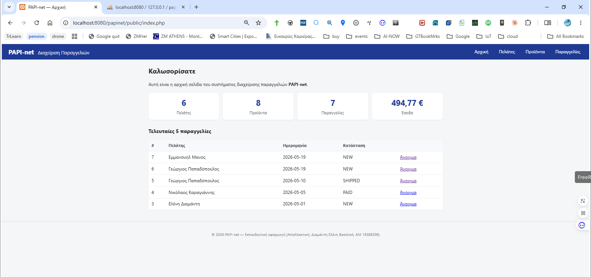
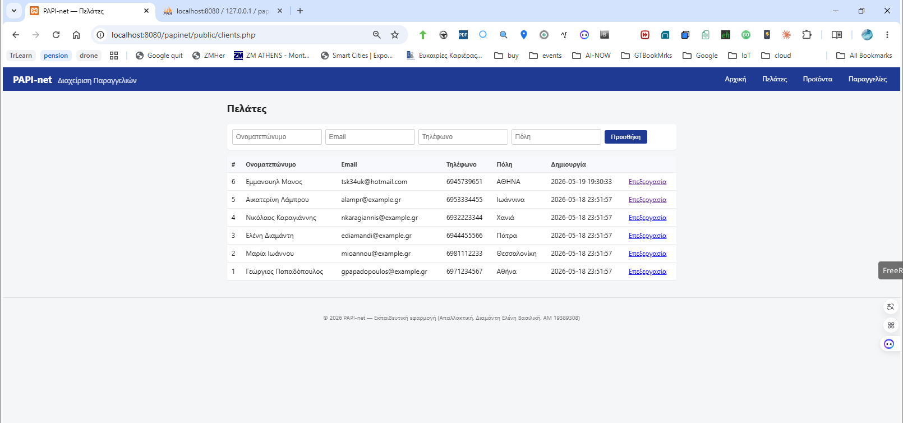
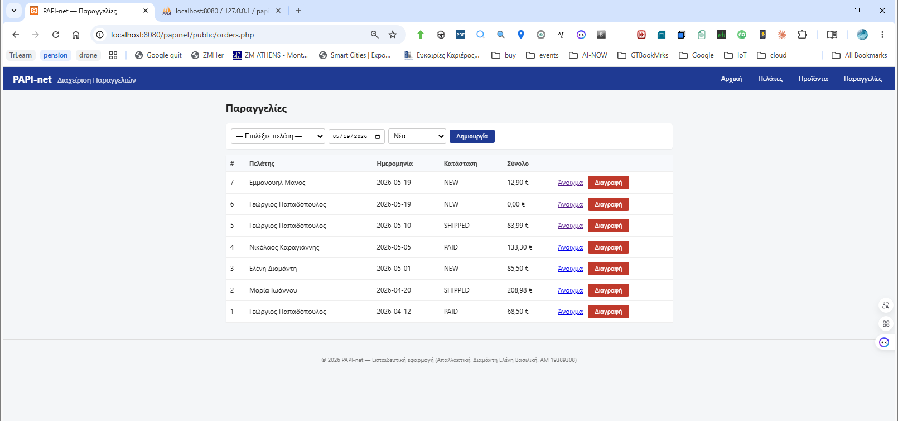
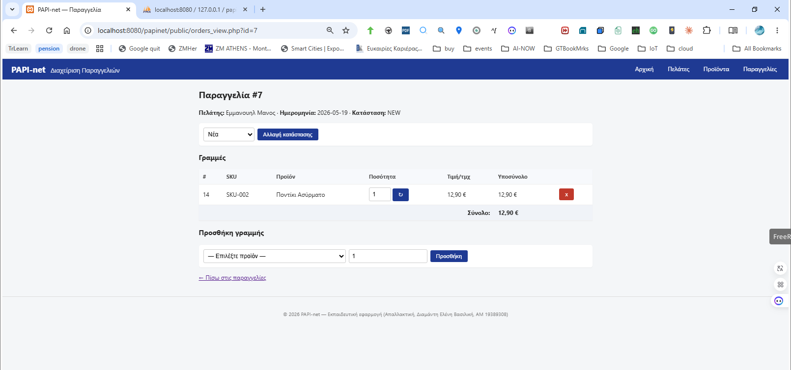

# PAPI-net — Σύστημα Διαχείρισης Παραγγελιών

Δυναμική web εφαρμογή σε **PHP 8 / MySQL** πάνω σε **XAMPP**, στο πλαίσιο της απαλλακτικής εργασίας του μαθήματος **«Τεχνολογία Διαδικτύου στην Ψηφιακή Βιομηχανία»**. Η εφαρμογή υλοποιεί ένα μικρό σύστημα διαχείρισης πελατών, προϊόντων και παραγγελιών (CRUD) με σύνδεση σε σχεσιακή βάση δεδομένων.


---

## 1. Σενάριο

**Σύστημα Διαχείρισης Παραγγελιών** για μικρή εμπορική επιχείρηση:

- Ο χρήστης (υπάλληλος) καταχωρεί **πελάτες** και **προϊόντα**.
- Δημιουργεί νέα **παραγγελία** για επιλεγμένο πελάτη.
- Προσθέτει γραμμές προϊόντων (**order_items**) με ποσότητα και τιμή.
- Η εφαρμογή υπολογίζει αυτόματα το σύνολο της παραγγελίας.
- Παρέχεται λίστα/αναζήτηση/επεξεργασία/διαγραφή για κάθε οντότητα.

Ροή: **Πελάτης → Παραγγελία → Γραμμές Παραγγελίας → Σύνολο**.

---

## 2. Αρχιτεκτονική

Κλασική 3-tier αρχιτεκτονική client–server:

<svg viewBox="0 0 820 220" xmlns="http://www.w3.org/2000/svg" style="max-width:100%;height:auto;background:#f5f7fa;border-radius:6px;padding:12px;font-family:'DejaVu Sans',sans-serif">
  <defs>
    <marker id="arrR1" viewBox="0 0 10 10" refX="9" refY="5" markerWidth="7" markerHeight="7" orient="auto"><path d="M0,0 L10,5 L0,10 z" fill="#444"/></marker>
  </defs>
  <rect x="20"  y="50" width="170" height="90" rx="8" fill="#e8f0f8" stroke="#1a4f8a" stroke-width="2"/>
  <text x="105" y="85" text-anchor="middle" font-weight="bold" font-size="15">Browser</text>
  <text x="105" y="108" text-anchor="middle" font-size="12">(HTML / JS)</text>
  <rect x="225" y="50" width="180" height="90" rx="8" fill="#fff3d6" stroke="#a36a0d" stroke-width="2"/>
  <text x="315" y="85" text-anchor="middle" font-weight="bold" font-size="15">Apache</text>
  <text x="315" y="108" text-anchor="middle" font-size="12">(XAMPP, mod_php)</text>
  <rect x="440" y="50" width="170" height="90" rx="8" fill="#cfe7d1" stroke="#2a7a32" stroke-width="2"/>
  <text x="525" y="85" text-anchor="middle" font-weight="bold" font-size="15">PHP 8</text>
  <text x="525" y="108" text-anchor="middle" font-size="12">scripts + PDO</text>
  <rect x="645" y="50" width="160" height="90" rx="8" fill="#ece2fb" stroke="#5a2db0" stroke-width="2"/>
  <text x="725" y="85" text-anchor="middle" font-weight="bold" font-size="15">MariaDB</text>
  <text x="725" y="108" text-anchor="middle" font-size="12">(papinet)</text>
  <path d="M190,82 L225,82"   stroke="#444" stroke-width="2" marker-end="url(#arrR1)"/>
  <text x="207" y="74"  text-anchor="middle" font-size="11" fill="#444">HTTP</text>
  <path d="M225,108 L190,108" stroke="#444" stroke-width="2" marker-end="url(#arrR1)"/>
  <text x="207" y="124" text-anchor="middle" font-size="11" fill="#444">HTML</text>
  <path d="M405,82 L440,82"   stroke="#444" stroke-width="2" marker-end="url(#arrR1)"/>
  <text x="422" y="74"  text-anchor="middle" font-size="11" fill="#444">mod_php</text>
  <path d="M440,108 L405,108" stroke="#444" stroke-width="2" marker-end="url(#arrR1)"/>
  <path d="M610,82 L645,82"   stroke="#444" stroke-width="2" marker-end="url(#arrR1)"/>
  <text x="627" y="74"  text-anchor="middle" font-size="11" fill="#444">SQL</text>
  <path d="M645,108 L610,108" stroke="#444" stroke-width="2" marker-end="url(#arrR1)"/>
  <text x="627" y="124" text-anchor="middle" font-size="11" fill="#444">rows</text>
  <text x="105" y="170" text-anchor="middle" font-size="12" fill="#666">requests</text>
  <text x="315" y="170" text-anchor="middle" font-size="12" fill="#666">web server</text>
  <text x="525" y="170" text-anchor="middle" font-size="12" fill="#666">application</text>
  <text x="725" y="170" text-anchor="middle" font-size="12" fill="#666">database</text>
</svg>


- **Front-end**: HTML5 + CSS + ελάχιστο JavaScript (validation).
- **Back-end**: PHP 8 με PDO (prepared statements — προστασία από SQL injection).
- **DB**: MySQL/MariaDB (XAMPP default), UTF-8 (`utf8mb4`).

---

## 3. Προαπαιτούμενα

| Λογισμικό | Έκδοση |
|---|---|
| XAMPP | ≥ 8.x (PHP 8.x + Apache 2.4 + MariaDB 10.x) |
| Browser | Chrome / Firefox / Edge (τρέχουσα έκδοση) |
| Λειτουργικό | Windows / Linux / macOS |

---

## 4. Εγκατάσταση

1. **Clone** του repository μέσα στον φάκελο `htdocs` του XAMPP:
   ```bash
   cd /opt/lampp/htdocs      # ή C:\xampp\htdocs σε Windows
   git clone https://github.com/idpe19389308/papi-net.git papinet
   ```
2. Εκκίνηση **Apache** και **MySQL** από το XAMPP Control Panel.
3. Άνοιγμα **phpMyAdmin** → `http://localhost/phpmyadmin`.
4. Δημιουργία βάσης `papinet` (utf8mb4_unicode_ci) και import:
   - [`sql/schema.sql`](sql/schema.sql) (πίνακες + foreign keys)
   - [`sql/seed.sql`](sql/seed.sql) (αρχικά demo δεδομένα)
5. Επεξεργασία [`includes/config.php`](includes/config.php) αν τα MySQL credentials διαφέρουν από τα default (`root` / κενό):
   ```php
   define('DB_HOST', 'localhost');
   define('DB_NAME', 'papinet');
   define('DB_USER', 'root');
   define('DB_PASS', '');
   ```
6. Άνοιγμα στον browser:
   ```
   http://localhost/papinet/public/
   ```

---

## 5. Δομή φακέλων

```
papinet/
├── README.md                ← αυτό το αρχείο
├── sql/
│   ├── schema.sql           ← CREATE TABLE
│   └── seed.sql             ← demo δεδομένα
├── includes/
│   ├── config.php           ← DB credentials + PDO connection
│   ├── header.php           ← κοινό header (navbar)
│   └── footer.php           ← κοινό footer
├── public/
│   ├── index.php            ← αρχική / dashboard
│   ├── clients.php          ← λίστα + CRUD πελατών
│   ├── products.php         ← λίστα + CRUD προϊόντων
│   ├── orders.php           ← λίστα παραγγελιών
│   ├── orders_view.php      ← λεπτομέρειες παραγγελίας + items
│   └── assets/
│       └── style.css
└── docs/
    └── img/                 ← screenshots για README
```

---

## 6. ER διάγραμμα

<svg viewBox="0 0 820 560" xmlns="http://www.w3.org/2000/svg" style="max-width:100%;height:auto;background:#f5f7fa;border-radius:6px;padding:12px;font-family:'DejaVu Sans',sans-serif">
  <defs>
    <marker id="arrR2" viewBox="0 0 10 10" refX="9" refY="5" markerWidth="8" markerHeight="8" orient="auto"><path d="M0,0 L10,5 L0,10 z" fill="#444"/></marker>
  </defs>
  <rect x="40" y="20" width="240" height="170" rx="8" fill="#e8f0f8" stroke="#1a4f8a" stroke-width="2"/>
  <rect x="40" y="20" width="240" height="28" rx="8" fill="#1a4f8a"/>
  <text x="160" y="40" text-anchor="middle" fill="#fff" font-weight="bold" font-size="15">clients</text>
  <text x="55" y="70" font-size="13"><tspan font-weight="bold">id</tspan>  PK</text>
  <text x="55" y="90" font-size="13">fullname</text>
  <text x="55" y="110" font-size="13">email</text>
  <text x="55" y="130" font-size="13">phone</text>
  <text x="55" y="150" font-size="13">city</text>
  <rect x="540" y="20" width="240" height="150" rx="8" fill="#fff3d6" stroke="#a36a0d" stroke-width="2"/>
  <rect x="540" y="20" width="240" height="28" rx="8" fill="#a36a0d"/>
  <text x="660" y="40" text-anchor="middle" fill="#fff" font-weight="bold" font-size="15">products</text>
  <text x="555" y="70" font-size="13"><tspan font-weight="bold">id</tspan>  PK</text>
  <text x="555" y="90" font-size="13">name</text>
  <text x="555" y="110" font-size="13">price</text>
  <text x="555" y="130" font-size="13">stock</text>
  <rect x="40" y="240" width="240" height="120" rx="8" fill="#cfe7d1" stroke="#2a7a32" stroke-width="2"/>
  <rect x="40" y="240" width="240" height="28" rx="8" fill="#2a7a32"/>
  <text x="160" y="260" text-anchor="middle" fill="#fff" font-weight="bold" font-size="15">orders</text>
  <text x="55" y="290" font-size="13"><tspan font-weight="bold">id</tspan>  PK</text>
  <text x="55" y="310" font-size="13">client_id  FK</text>
  <text x="55" y="330" font-size="13">order_date</text>
  <text x="55" y="350" font-size="13">status</text>
  <rect x="290" y="400" width="280" height="140" rx="8" fill="#ece2fb" stroke="#5a2db0" stroke-width="2"/>
  <rect x="290" y="400" width="280" height="28" rx="8" fill="#5a2db0"/>
  <text x="430" y="420" text-anchor="middle" fill="#fff" font-weight="bold" font-size="15">order_items</text>
  <text x="305" y="450" font-size="13"><tspan font-weight="bold">id</tspan>  PK</text>
  <text x="305" y="470" font-size="13">order_id  FK</text>
  <text x="305" y="490" font-size="13">product_id  FK</text>
  <text x="305" y="510" font-size="13">qty</text>
  <text x="305" y="530" font-size="13">unit_price</text>
  <path d="M160,190 L160,235" stroke="#444" stroke-width="2" fill="none" marker-end="url(#arrR2)"/>
  <text x="170" y="215" font-size="12" fill="#1a4f8a">1 — N</text>
  <path d="M250,360 L380,395" stroke="#444" stroke-width="2" fill="none" marker-end="url(#arrR2)"/>
  <text x="265" y="380" font-size="12" fill="#2a7a32">1 — N</text>
  <path d="M620,170 L500,395" stroke="#444" stroke-width="2" stroke-dasharray="4,3" fill="none" marker-end="url(#arrR2)"/>
  <text x="540" y="290" font-size="12" fill="#a36a0d">1 — N</text>
</svg>

**Σχέσεις**:
- `clients` 1 — N `orders`
- `orders` 1 — N `order_items`
- `products` 1 — N `order_items`

---

## 7. Δυναμικές σελίδες (7 σελίδες, ≥ 4)

| Σελίδα | Περιγραφή | CRUD |
|---|---|---|
| [`public/index.php`](public/index.php) | Dashboard: σύνολα πελατών, παραγγελιών μήνα, top προϊόν | R |
| [`public/clients.php`](public/clients.php) | Λίστα πελατών + **αναζήτηση** (ονοματεπώνυμο/email) + προσθήκη | C/R |
| [`public/clients_edit.php`](public/clients_edit.php) | Επεξεργασία/διαγραφή στοιχείων πελάτη | U/D |
| [`public/products.php`](public/products.php) | Κατάλογος προϊόντων με τιμές & απόθεμα + προσθήκη | C/R |
| [`public/products_edit.php`](public/products_edit.php) | Επεξεργασία/διαγραφή προϊόντος | U/D |
| [`public/orders.php`](public/orders.php) | Λίστα παραγγελιών με **φίλτρο κατάστασης** + δημιουργία νέας | C/R/D |
| `public/orders_view.php` | Λεπτομέρειες παραγγελίας — προσθήκη/αφαίρεση γραμμών | R/U/D |

### 7.1 Λειτουργίες αναζήτησης & φίλτρου

- **`clients.php`** — Φόρμα αναζήτησης ελεύθερου κειμένου (παράμετρος `?q=`). Αναζητά case-insensitive σε `fullname` **ή** `email` με PDO prepared statement και wildcards `%q%`. Κενό πεδίο → εμφανίζονται όλοι.
- **`orders.php`** — Dropdown φίλτρου κατάστασης (παράμετρος `?status=`). Επιλογές: *Όλες*, *Νέα*, *Πληρωμένη*, *Απεσταλμένη*, *Ακυρωμένη*. Τιμή σε whitelist guard (anti-injection)· `ALL` → χωρίς `WHERE`.

---

## 8. Screenshots

> Τα screenshots θα τα προσθέσω η ίδια μετά την τοπική εγκατάσταση. Τοποθετούνται στον φάκελο `docs/img/`.






---

## 9. Άδεια χρήσης

[MIT License](LICENSE) — το repository είναι δημόσιο στο GitHub.

---

## 10. Δήλωση εργαλείων ΤΝ

Όπως ζητάει η εκφώνηση, αναφέρω παρακάτω τη χρήση εργαλείων Τεχνητής Νοημοσύνης κατά την υλοποίηση της εργασίας.

Για το κείμενο της αναφοράς χρησιμοποίησα κυρίως το ChatGPT για ορθογραφικό έλεγχο, για αναδιατυπώσεις σε προτάσεις, και κάποιες φορές για να μου δώσει μια ιδέα για το πώς να δομήσω καλύτερα μια ενότητα.

Για τις δυναμικές σελίδες της εφαρμογής (Μέρος Α) χρησιμοποίησα τον Claude (Anthropic). Για παραδειγματα κώδικα PHP/PDO. Στη συνέχεια διάβαζα τον κώδικα γραμμή προς γραμμή, τον τροποποιούσα όπου ήθελα διαφορετική λογική ή UI, και τον δοκίμαζα τοπικά πάνω σε XAMPP. 

Για τις διαμορφώσεις του δικτύου (Μέρος Β) χρησιμοποίησα επίσης τον Claude. Για τις καταλληλες εντολες Cisco IOS (VLAN configuration, dot1Q subinterfaces, router ospf, access-lists, εφαρμογή ACL inbound στις subinterfaces). Δοκίμασα τα configs μέσα στο Packet Tracer, εντόπισα κάποια λάθη αντιστοίχισης IP που δεν ταίριαζαν με το PDF της εκφώνησης (συγκεκριμένα στο WAN link R-CHA ↔ R-PAT) και τα διόρθωσα.

Όλος ο κώδικας και όλα τα configs δοκιμάστηκαν από εμένα στο τοπικό μου περιβάλλον πριν την παράδοση.

---

## 11. Συγγραφέας

- **Σπουδάστρια**: Ελένη Βασιλική Διαμάντη
- **Α.Μ.**: 19389308
- **Διδάσκων**: Δρ. Μιχάλης Ξευγένης
- **Μάθημα**: Τεχνολογία Διαδικτύου στην Ψηφιακή Βιομηχανία
- **Ακαδημαϊκό έτος**: 2025–2026
